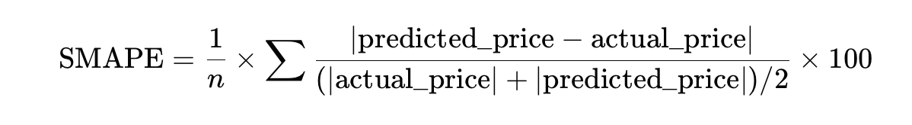
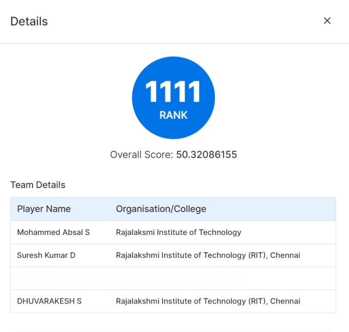

<div align="center">

# 🛒 Amazon ML 2025 – Price Prediction Pipeline

&nbsp;
&nbsp;
&nbsp;
-purple)&nbsp;


<br>

**Team:** `asdf`  
**Members:** Mohammed Asbal S · Suresh Kumar · Dhuvarakesh

</div>

---

## ✨ Overview
This repository contains our experimental pipeline for predicting product prices from catalog text (and optionally image-derived embeddings, see artifacts). The core solution focuses on **robust textual feature engineering + tree / linear ensemble stacking**, achieving a validation **SMAPE score of 50.3** on our held-out split (and similar leaderboard behavior).

We emphasize three pillars:
1. 🎯 Domain-aware quantity extraction (pack size, unit size normalization to oz, total quantity)
2. 🧬 Multi-channel text representation (character n‑grams + word n‑grams reduced via SVD)
3. 🤝 Hybrid ensemble (LightGBM / RandomForest / ExtraTrees / Ridge → stacked meta-model)

---

## 🗂️ Repository Structure

```
predict.py           # Main end-to-end training + inference script (text-only pipeline)
dataset/
	├─ train.csv       # Training data (expects columns incl. catalog_content, price, sample_id)
	└─ test.csv        # Test data (expects catalog_content, sample_id)
artifacts/           # Unused by predict.py (see note below)
	├─ tfidf.joblib    # Saved vectorizer (alt experiments)
	├─ svd.joblib      # Dimensionality reduction object (alt experiments)
	├─ pca_img.joblib  # PCA fit for image embeddings (alternative multimodal path)
	├─ train_img_feats.npy / test_img_feats.npy    # Raw image feature arrays
	├─ train_img_pca.npy  / test_img_pca.npy       # Reduced image features
	├─ train_svd.npy / test_svd.npy                # Reduced textual embeddings (variant)
```

### 🔍 Important Clarification About `artifacts/`
The current published `predict.py` **does not load or use** the contents of `artifacts/`. Those files belong to an **alternative / multimodal approach** we explored (combining image + text signals with PCA/SVD compression). We kept them to document experimentation breadth and for future extension. Feel free to ignore them if you only need to reproduce the baseline textual ensemble.

---

## 🧪 Approach Breakdown

### 1. Feature Engineering
- Quantity parsing: regex-driven extraction of pack count, unit size (supports oz, ml, l, g, kg, lb) → normalized into ounces + logarithmic transforms.
- Numeric text stats: length, word count, uppercase ratio, digit ratio, number aggregates (count, sum, max, mean, etc.).
- Category & descriptor flags: food / beverage / health / beauty / cleaning / baby / pet / paper + premium / value / bulk cues.
- Brand target encoding: smoothed (Bayesian style) mean and std of log-price + brand frequency.
- Text representation: dual TF‑IDF (char 3–5 grams, word 1–3 grams) → TruncatedSVD (80 + 180 components).

### 2. Modeling
- Base learners (adaptive to environment):
	- If LightGBM installed → 3 diversified LGBMRegressor variants.
	- Otherwise RandomForestRegressor fallback.
	- Plus ExtraTreesRegressor & Ridge for bias / variance complementarity.
- Stacking: Ridge meta-model over validation predictions (selects best alpha among candidates).
- Bias correction: small multiplicative adjustment if mean prediction drift within safe band.

### 3. Evaluation Metric
Symmetric Mean Absolute Percentage Error (SMAPE) implemented explicitly (robust to scale, handles zeros with epsilon).
<p align="center">
	
</p>


### 4. Final Score
Internal validation (15% split) produced **SMAPE ≈ 50.3%**. This is reported as our baseline reference score.

---

## 🧭 Pipeline Flow

```mermaid
flowchart LR
		A[CSV Data: train.csv / test.csv] --> B[Preprocess & Column Normalization]
		B --> C[Quantity & Numeric Feature Extraction]
		B --> D[Brand Encoding]
		B --> E[TF-IDF (char + word) -> SVD]
		C --> F[Feature Concatenation]
		D --> F
		E --> F
		F --> G[Base Models]
		G --> H[Stacking Ridge Meta-Model]
		H --> I[Bias Correction]
		I --> J[Predictions CSV]
```

---

## 🚀 Quick Start

### 1. Clone & Prepare Data
Place `train.csv` and `test.csv` into `dataset/` (existing paths already referenced inside `predict.py`). Ensure columns:
- `sample_id`
- `catalog_content` (text)
- `price` (only in train)

### 2. (Optional) Create Virtual Environment
```powershell
python -m venv .venv
./.venv/Scripts/Activate.ps1
```

### 3. Install Dependencies
Minimal requirements (LightGBM optional):
```powershell
pip install numpy pandas scikit-learn lightgbm
```
If LightGBM installation fails on your platform, you can omit it—the script will automatically fall back to pure scikit-learn models.

### 4. Run Pipeline
```powershell
python predict.py
```
Outputs: `test_out.csv` at project root with columns: `sample_id,price`.

---

## 📊 Example Console Snippet
```
🚀 ENHANCED PRICE PREDICTION PIPELINE
📥 Loading data...
📊 Train shape: (XXXXX, YY) Test shape: (ZZZZ, YY)
🛠 FEATURE ENGINEERING
✅ Created  ... numeric features
✅ Created  ... brand features
✅ Created  ... text features
✅ Final feature shape: (N, D)
🎯 MODEL TRAINING
[1/5] Training lgb1 ... ✓  Val SMAPE: 51.2% | Val MAE: $X.XX
...
📈 Simple Ensemble Average Val SMAPE: 50.9%
🎯 Meta-model Val SMAPE: 50.3%
💾 Predictions saved to: test_out.csv
```

### 🏅 Leaderboard Snapshot
<p align="center">
	<!-- If you add the file locally, place it under docs/ or assets/ and adjust the path -->
	
	<br>
	<em>Rank & validation score illustration (team: asdf)</em>
</p>

---

## 🧪 Alternative / Multimodal Experiments (Artifacts Folder)
We explored integrating **image embeddings** (PCA‑reduced) concatenated with text features and also persisting TF‑IDF / SVD objects for reproducibility. These experiments are not currently wired into `predict.py`. To extend:
1. Load `train_img_pca.npy`, `test_img_pca.npy`.
2. Concatenate with existing feature arrays before model training.
3. Re-tune regularization (Ridge) to mitigate potential overfitting.

Potential uplift avenues: cross-validated out-of-fold stacking, monotonic constraints in LightGBM, quantile regression for interval predictions, transform-based deep encoders.

---

## 🧹 Reproducibility & Determinism
- Fixed `random_state` seeds across models.
- Non-determinism may arise from multithreaded tree learners (LightGBM). For stricter reproducibility: set `deterministic=True` and `num_threads=1` (with speed trade-off).

---

## 🛠 Troubleshooting
| Symptom | Likely Cause | Fix |
|---------|--------------|-----|
| LightGBM warning | Not installed | `pip install lightgbm` or ignore (fallback triggers) |
| Memory spike during TF‑IDF | Large vocab | Reduce `max_features` or increase `min_df` |
| Poor SMAPE > 60 | Quantity regex mismatch | Inspect samples; adjust patterns in `extract_quantity_info` |
| Predictions all similar | Failed feature concat | Check array shapes before `np.hstack` |

---

## 🗺 Roadmap (Next Steps)
- [ ] Integrate image branch seamlessly with flag.
- [ ] Add k-fold stacking for robust meta-learning.
- [ ] Implement lightweight FastText / SentenceTransformer embeddings comparison.
- [ ] Hyperparameter search (Optuna) for automated tuning.
- [ ] Dockerfile + Makefile for portable runs.

---

## 🤝 Contribution Guidelines
While this was developed for a competition context, feel free to fork and extend. Suggested PR scope: modularization of feature blocks, adding configuration YAML, or integrating experiment tracking (e.g., MLflow).

---

## 📄 Citation (If You Re-Use Ideas)
Please reference the repository or credit the team `asdf` and members Mohammed Asbal S, Suresh Kumar, Dhuvarakesh in derivative works / reports.

---

## 🙌 Acknowledgements
- Open-source libraries: NumPy, pandas, scikit-learn, LightGBM.
- Inspiration from common Kaggle text + tabular ensembling patterns.

---

<div align="center">

Made with 🔍 feature obsession and a dash of ☕.

</div>

